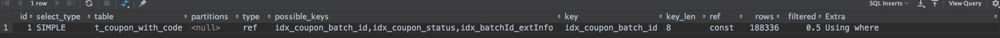

## 问题1：like '%xx%'导致sql执行时间较长
问题sql：
```sql
select ID,code,amount,used_amount,batch_id,passuid,sms_user_mobile,`status`,bind_status,use_status,order_id,bind_time,pay_time,refund_time,
refund_nums,use_start_time,use_end_time,ext_info,created_by,created_time,updated_by,updated_timefrom t_coupon_with_code
where batch_id in (?,?,?,?,?,?,?, ?)and ext_info like CONCAT('%',?,'%');
```
列`batch_id`上有索引，通过该索引能匹配到73万条记录，like从这73万条记录里过滤需耗时2s左右。

后续通过分析列`ext_info`的结构，sql语句修改为：
```sql
select ID,code,amount,used_amount,batch_id,passuid,sms_user_mobile,`status`,bind_status,use_status,order_id,bind_time,pay_time,refund_time,
refund_nums,use_start_time,use_end_time,ext_info,created_by,created_time,updated_by,updated_timefrom t_coupon_with_code
where batch_id in (?,?,?,?,?,?,?, ?)and ext_info like CONCAT(?,'%');
```
并新建如下索引：
```sql
alter table t_coupon_with_code  add INDEX  idx_batchId_extInfo (batch_id, ext_info(50));
```

## 问题2：数据库选错索引导致sql执行时间较长
**问题描述：**

通过附录1的异常堆栈，找到最下面的caused by：`Caused by: java.net.SocketTimeoutException: Read timed out`，
表示服务器和数据库建立的这个sokcet连接上，在规定的时间内（通过异常堆栈最开始的信息，这个时间是5000ms左右）没有读取到数据包。
分析到这里，基本就可以确定是对应的sql语句在数据库层面执行时间够长，导致超时。

还有一个问题背景：有一个批次的代金券绑定不会出现接口超时。

**问题分析：**

分析sql语句性能首先想到的肯定就是explain，由于日志里只打印了prepared statement，没有打印具体的参数。
我们通过分析该请求，可以算出来对应的参数。即batch_id可能是203451、203452、203453、203454、203455、203456、203457、203458。
该表的总数据量：5kw+

```sql
select ID             ,code             ,amount             ,used_amount             ,
  batch_id             ,passuid             ,sms_user_mobile             ,`status`             ,
  bind_status             ,use_status             ,order_id             ,bind_time             ,
  pay_time             ,refund_time             ,refund_nums             ,use_start_time             ,
  use_end_time             ,ext_info             ,created_by             ,created_time             ,
  updated_by             ,updated_time            
  from t_coupon_with_code 
  where batch_id=? 
  and `status` != 'DELETE'         
  and bind_status = 0 
  and use_status = 0         
  order by id 
  limit 1
```
通过explian，分析将这些参数代入sql进行分析，立马发现问题。
```sql
-- 10w
explain
select * from moviec_marketing.t_coupon_with_code
where batch_id=203451 and `status` != 'DELETE'         and bind_status = 0 and use_status = 0
order by id
limit 1;
```



```sql
-- 10w
explain
select * from moviec_marketing.t_coupon_with_code
where batch_id=203453 and `status` != 'DELETE'         and bind_status = 0 and use_status = 0
order by id
limit 1;
```


仅仅是因为batch_id的参数值不同，导致执行计划不同，第二个sql选择扫描主键索引，在5kw+的数据量的情况下，时间肯定很长，经测试基本要1分钟。

由于order by会影响索引的选择，所以第一个想到的就是去掉order by（已经确认，去掉order by不会影响业务逻辑），去掉之后发现确实好了。

第二个解决方案就是强制指定索引。
```sql
-- 10w
explain
select * from moviec_marketing.t_coupon_with_code force index(idx_coupon_batch_id)
where batch_id=203453 and `status` != 'DELETE'         and bind_status = 0 and use_status = 0
order by id
limit 1;
```

mysql为什么会选错索引？
> 简单来说就是mysql是通过采样统计的方式来计算索引的基数的，所以对索引基数的统计有可能存在较大的偏差。
> 通过`analyze table t` 命令，可以用来重新统计索引信息。

## 总结
1、该功能是去年的做的，但是由于当时上线时候文惠活动已经结束，导致问题没有暴露出来。

2、like '%xx%'原则上不应该用于业务系统sql中，这种需求应该交给搜索引擎来处理。

3、mysql对索引的处理是比较复杂的，要会用explain。

4、要仔细阅读异常堆栈。


## 附录1：问题2异常堆栈
```log
2020-05-11 16:19:00.768 [http-nio-8080-exec-65] [1589185135167] [ERROR] [movie.pandora.api.aop.ApiControllerAdvice] - org.springframework.dao.RecoverableDataAccessException
org.springframework.dao.RecoverableDataAccessException: 
### Error querying database.  Cause: com.mysql.jdbc.exceptions.jdbc4.CommunicationsException: Communications link failure

The last packet successfully received from the server was 5,020 milliseconds ago.  The last packet sent successfully to the server was 5,019 milliseconds ago.
### The error may exist in META-INF/mybatis/pandora/CouponWithCode.xml
### The error may involve CouponWithCodeDAO.selectOneByBatchIdNoBind-Inline
### The error occurred while setting parameters
### SQL: select ID             ,code             ,amount             ,used_amount             ,batch_id             ,passuid             ,sms_user_mobile             ,`status`             ,bind_status             ,use_status             ,order_id             ,bind_time             ,pay_time             ,refund_time             ,refund_nums             ,use_start_time             ,use_end_time             ,ext_info             ,created_by             ,created_time             ,updated_by             ,updated_time            from t_coupon_with_code where batch_id=? and `status` != 'DELETE'         and bind_status = 0 and use_status = 0         order by id limit 1
### Cause: com.mysql.jdbc.exceptions.jdbc4.CommunicationsException: Communications link failure

The last packet successfully received from the server was 5,020 milliseconds ago.  The last packet sent successfully to the server was 5,019 milliseconds ago.
; SQL []; Communications link failure

The last packet successfully received from the server was 5,020 milliseconds ago.  The last packet sent successfully to the server was 5,019 milliseconds ago.; nested exception is com.mysql.jdbc.exceptions.jdbc4.CommunicationsException: Communications link failure

The last packet successfully received from the server was 5,020 milliseconds ago.  The last packet sent successfully to the server was 5,019 milliseconds ago.
	at org.springframework.jdbc.support.SQLExceptionSubclassTranslator.doTranslate(SQLExceptionSubclassTranslator.java:98) ~[spring-jdbc-4.3.17.RELEASE.jar:4.3.17.RELEASE]
	at org.springframework.jdbc.support.AbstractFallbackSQLExceptionTranslator.translate(AbstractFallbackSQLExceptionTranslator.java:73) ~[spring-jdbc-4.3.17.RELEASE.jar:4.3.17.RELEASE]
	at org.springframework.jdbc.support.AbstractFallbackSQLExceptionTranslator.translate(AbstractFallbackSQLExceptionTranslator.java:82) ~[spring-jdbc-4.3.17.RELEASE.jar:4.3.17.RELEASE]
	at org.mybatis.spring.MyBatisExceptionTranslator.translateExceptionIfPossible(MyBatisExceptionTranslator.java:74) ~[mybatis-spring-1.2.4.jar:1.2.4]
	at org.mybatis.spring.SqlSessionTemplate$SqlSessionInterceptor.invoke(SqlSessionTemplate.java:421) ~[mybatis-spring-1.2.4.jar:1.2.4]
	at com.sun.proxy.$Proxy73.selectOne(Unknown Source) ~[?:?]
	at org.mybatis.spring.SqlSessionTemplate.selectOne(SqlSessionTemplate.java:166) ~[mybatis-spring-1.2.4.jar:1.2.4]
	at com.baidu.movie.pandora.dao.commons.mybatis.MybatisBaseDAOImpl.queryForObject(MybatisBaseDAOImpl.java:131) ~[pandora-dao-1.0-SNAPSHOT.jar:?]
	at com.baidu.movie.pandora.dao.couponwithcode.CouponWithCodeDAOImpl.selectOneByBatchIdNoBind(CouponWithCodeDAOImpl.java:68) ~[pandora-dao-1.0-SNAPSHOT.jar:?]
	at sun.reflect.NativeMethodAccessorImpl.invoke0(Native Method) ~[?:1.8.0_212]
	at sun.reflect.NativeMethodAccessorImpl.invoke(NativeMethodAccessorImpl.java:62) ~[?:1.8.0_212]
	at sun.reflect.DelegatingMethodAccessorImpl.invoke(DelegatingMethodAccessorImpl.java:43) ~[?:1.8.0_212]
	at java.lang.reflect.Method.invoke(Method.java:498) ~[?:1.8.0_212]
	at org.springframework.aop.support.AopUtils.invokeJoinpointUsingReflection(AopUtils.java:333) ~[spring-aop-4.3.17.RELEASE.jar:4.3.17.RELEASE]
	at org.springframework.aop.framework.ReflectiveMethodInvocation.invokeJoinpoint(ReflectiveMethodInvocation.java:190) ~[spring-aop-4.3.17.RELEASE.jar:4.3.17.RELEASE]
	at org.springframework.aop.framework.ReflectiveMethodInvocation.proceed(ReflectiveMethodInvocation.java:157) ~[spring-aop-4.3.17.RELEASE.jar:4.3.17.RELEASE]
	at org.springframework.dao.support.PersistenceExceptionTranslationInterceptor.invoke(PersistenceExceptionTranslationInterceptor.java:136) ~[spring-tx-4.3.17.RELEASE.jar:4.3.17.RELEASE]
	at org.springframework.aop.framework.ReflectiveMethodInvocation.proceed(ReflectiveMethodInvocation.java:179) ~[spring-aop-4.3.17.RELEASE.jar:4.3.17.RELEASE]
	at org.springframework.aop.framework.JdkDynamicAopProxy.invoke(JdkDynamicAopProxy.java:213) ~[spring-aop-4.3.17.RELEASE.jar:4.3.17.RELEASE]
	at com.sun.proxy.$Proxy113.selectOneByBatchIdNoBind(Unknown Source) ~[?:?]
	at com.baidu.movie.pandora.repository.mybatis.impl.MybatisCouponWithCodeRepositoryImpl.findOneByBatchIdNoBind(MybatisCouponWithCodeRepositoryImpl.java:96) ~[pandora-repository-1.0-SNAPSHOT.jar:?]
	at sun.reflect.NativeMethodAccessorImpl.invoke0(Native Method) ~[?:1.8.0_212]
	at sun.reflect.NativeMethodAccessorImpl.invoke(NativeMethodAccessorImpl.java:62) ~[?:1.8.0_212]
	at sun.reflect.DelegatingMethodAccessorImpl.invoke(DelegatingMethodAccessorImpl.java:43) ~[?:1.8.0_212]
	at java.lang.reflect.Method.invoke(Method.java:498) ~[?:1.8.0_212]
	at org.springframework.aop.support.AopUtils.invokeJoinpointUsingReflection(AopUtils.java:333) ~[spring-aop-4.3.17.RELEASE.jar:4.3.17.RELEASE]
	at org.springframework.aop.framework.ReflectiveMethodInvocation.invokeJoinpoint(ReflectiveMethodInvocation.java:190) ~[spring-aop-4.3.17.RELEASE.jar:4.3.17.RELEASE]
	at org.springframework.aop.framework.ReflectiveMethodInvocation.proceed(ReflectiveMethodInvocation.java:157) ~[spring-aop-4.3.17.RELEASE.jar:4.3.17.RELEASE]
	at org.springframework.dao.support.PersistenceExceptionTranslationInterceptor.invoke(PersistenceExceptionTranslationInterceptor.java:136) ~[spring-tx-4.3.17.RELEASE.jar:4.3.17.RELEASE]
	at org.springframework.aop.framework.ReflectiveMethodInvocation.proceed(ReflectiveMethodInvocation.java:179) ~[spring-aop-4.3.17.RELEASE.jar:4.3.17.RELEASE]
	at org.springframework.aop.framework.JdkDynamicAopProxy.invoke(JdkDynamicAopProxy.java:213) ~[spring-aop-4.3.17.RELEASE.jar:4.3.17.RELEASE]
	at com.sun.proxy.$Proxy114.findOneByBatchIdNoBind(Unknown Source) ~[?:?]
	at com.baidu.movie.pandora.command.command.wh.BindWhCouponCommand.bindWhCoupon(BindWhCouponCommand.java:136) ~[pandora-command-1.0-SNAPSHOT.jar:?]
	at com.baidu.movie.pandora.api.controller.CouponApiController.bindWenHuiCoupon(CouponApiController.java:224) ~[classes/:?]
	at com.baidu.movie.pandora.api.controller.CouponApiController$$FastClassBySpringCGLIB$$9f176e7.invoke(<generated>) ~[classes/:?]
	at org.springframework.cglib.proxy.MethodProxy.invoke(MethodProxy.java:204) ~[spring-core-4.3.17.RELEASE.jar:4.3.17.RELEASE]
	at org.springframework.aop.framework.CglibAopProxy$CglibMethodInvocation.invokeJoinpoint(CglibAopProxy.java:736) ~[spring-aop-4.3.17.RELEASE.jar:4.3.17.RELEASE]
	at org.springframework.aop.framework.ReflectiveMethodInvocation.proceed(ReflectiveMethodInvocation.java:157) ~[spring-aop-4.3.17.RELEASE.jar:4.3.17.RELEASE]
	at com.baidu.movie.aop.LoggerInterceptor.invoke(LoggerInterceptor.java:49) ~[movie-base-1.2.0-SNAPSHOT.jar:?]
	at com.baidu.movie.aop.LoggerInterceptor.logerOut(LoggerInterceptor.java:37) ~[movie-base-1.2.0-SNAPSHOT.jar:?]
	at sun.reflect.GeneratedMethodAccessor382.invoke(Unknown Source) ~[?:?]
	at sun.reflect.DelegatingMethodAccessorImpl.invoke(DelegatingMethodAccessorImpl.java:43) ~[?:1.8.0_212]
	at java.lang.reflect.Method.invoke(Method.java:498) ~[?:1.8.0_212]
	at org.springframework.aop.aspectj.AbstractAspectJAdvice.invokeAdviceMethodWithGivenArgs(AbstractAspectJAdvice.java:627) ~[spring-aop-4.3.17.RELEASE.jar:4.3.17.RELEASE]
	at org.springframework.aop.aspectj.AbstractAspectJAdvice.invokeAdviceMethod(AbstractAspectJAdvice.java:616) ~[spring-aop-4.3.17.RELEASE.jar:4.3.17.RELEASE]
	at org.springframework.aop.aspectj.AspectJAroundAdvice.invoke(AspectJAroundAdvice.java:70) ~[spring-aop-4.3.17.RELEASE.jar:4.3.17.RELEASE]
	at org.springframework.aop.framework.ReflectiveMethodInvocation.proceed(ReflectiveMethodInvocation.java:168) ~[spring-aop-4.3.17.RELEASE.jar:4.3.17.RELEASE]
	at org.springframework.aop.aspectj.MethodInvocationProceedingJoinPoint.proceed(MethodInvocationProceedingJoinPoint.java:84) ~[spring-aop-4.3.17.RELEASE.jar:4.3.17.RELEASE]
	at com.baidu.movie.pandora.api.aop.PandoraApiAuthAspect.auth(PandoraApiAuthAspect.java:83) ~[classes/:?]
	at sun.reflect.GeneratedMethodAccessor347.invoke(Unknown Source) ~[?:?]
	at sun.reflect.DelegatingMethodAccessorImpl.invoke(DelegatingMethodAccessorImpl.java:43) ~[?:1.8.0_212]
	at java.lang.reflect.Method.invoke(Method.java:498) ~[?:1.8.0_212]
	at org.springframework.aop.aspectj.AbstractAspectJAdvice.invokeAdviceMethodWithGivenArgs(AbstractAspectJAdvice.java:627) ~[spring-aop-4.3.17.RELEASE.jar:4.3.17.RELEASE]
	at org.springframework.aop.aspectj.AbstractAspectJAdvice.invokeAdviceMethod(AbstractAspectJAdvice.java:616) ~[spring-aop-4.3.17.RELEASE.jar:4.3.17.RELEASE]
	at org.springframework.aop.aspectj.AspectJAroundAdvice.invoke(AspectJAroundAdvice.java:70) ~[spring-aop-4.3.17.RELEASE.jar:4.3.17.RELEASE]
	at org.springframework.aop.framework.ReflectiveMethodInvocation.proceed(ReflectiveMethodInvocation.java:168) ~[spring-aop-4.3.17.RELEASE.jar:4.3.17.RELEASE]
	at org.springframework.aop.aspectj.MethodInvocationProceedingJoinPoint.proceed(MethodInvocationProceedingJoinPoint.java:84) ~[spring-aop-4.3.17.RELEASE.jar:4.3.17.RELEASE]
	at com.baidu.movie.pandora.api.aop.PandoraApiAspect.auth(PandoraApiAspect.java:36) ~[classes/:?]
	at sun.reflect.GeneratedMethodAccessor346.invoke(Unknown Source) ~[?:?]
	at sun.reflect.DelegatingMethodAccessorImpl.invoke(DelegatingMethodAccessorImpl.java:43) ~[?:1.8.0_212]
	at java.lang.reflect.Method.invoke(Method.java:498) ~[?:1.8.0_212]
	at org.springframework.aop.aspectj.AbstractAspectJAdvice.invokeAdviceMethodWithGivenArgs(AbstractAspectJAdvice.java:627) ~[spring-aop-4.3.17.RELEASE.jar:4.3.17.RELEASE]
	at org.springframework.aop.aspectj.AbstractAspectJAdvice.invokeAdviceMethod(AbstractAspectJAdvice.java:616) ~[spring-aop-4.3.17.RELEASE.jar:4.3.17.RELEASE]
	at org.springframework.aop.aspectj.AspectJAroundAdvice.invoke(AspectJAroundAdvice.java:70) ~[spring-aop-4.3.17.RELEASE.jar:4.3.17.RELEASE]
	at org.springframework.aop.framework.ReflectiveMethodInvocation.proceed(ReflectiveMethodInvocation.java:168) ~[spring-aop-4.3.17.RELEASE.jar:4.3.17.RELEASE]
	at org.springframework.aop.aspectj.MethodInvocationProceedingJoinPoint.proceed(MethodInvocationProceedingJoinPoint.java:84) ~[spring-aop-4.3.17.RELEASE.jar:4.3.17.RELEASE]
	at com.baidu.movie.aop.ValidateAspect.validate(ValidateAspect.java:46) ~[movie-base-1.2.0-SNAPSHOT.jar:?]
	at sun.reflect.GeneratedMethodAccessor345.invoke(Unknown Source) ~[?:?]
	at sun.reflect.DelegatingMethodAccessorImpl.invoke(DelegatingMethodAccessorImpl.java:43) ~[?:1.8.0_212]
	at java.lang.reflect.Method.invoke(Method.java:498) ~[?:1.8.0_212]
	at org.springframework.aop.aspectj.AbstractAspectJAdvice.invokeAdviceMethodWithGivenArgs(AbstractAspectJAdvice.java:627) ~[spring-aop-4.3.17.RELEASE.jar:4.3.17.RELEASE]
	at org.springframework.aop.aspectj.AbstractAspectJAdvice.invokeAdviceMethod(AbstractAspectJAdvice.java:616) ~[spring-aop-4.3.17.RELEASE.jar:4.3.17.RELEASE]
	at org.springframework.aop.aspectj.AspectJAroundAdvice.invoke(AspectJAroundAdvice.java:70) ~[spring-aop-4.3.17.RELEASE.jar:4.3.17.RELEASE]
	at org.springframework.aop.framework.ReflectiveMethodInvocation.proceed(ReflectiveMethodInvocation.java:168) ~[spring-aop-4.3.17.RELEASE.jar:4.3.17.RELEASE]
	at org.springframework.aop.interceptor.ExposeInvocationInterceptor.invoke(ExposeInvocationInterceptor.java:92) ~[spring-aop-4.3.17.RELEASE.jar:4.3.17.RELEASE]
	at org.springframework.aop.framework.ReflectiveMethodInvocation.proceed(ReflectiveMethodInvocation.java:179) ~[spring-aop-4.3.17.RELEASE.jar:4.3.17.RELEASE]
	at org.springframework.aop.aspectj.MethodInvocationProceedingJoinPoint.proceed(MethodInvocationProceedingJoinPoint.java:96) ~[spring-aop-4.3.17.RELEASE.jar:4.3.17.RELEASE]
	at com.baidu.movie.aop.UnionUserAspect.userAuthCheck(UnionUserAspect.java:72) ~[movie-base-1.2.0-SNAPSHOT.jar:?]
	at sun.reflect.GeneratedMethodAccessor561.invoke(Unknown Source) ~[?:?]
	at sun.reflect.DelegatingMethodAccessorImpl.invoke(DelegatingMethodAccessorImpl.java:43) ~[?:1.8.0_212]
	at java.lang.reflect.Method.invoke(Method.java:498) ~[?:1.8.0_212]
	at org.springframework.aop.aspectj.AbstractAspectJAdvice.invokeAdviceMethodWithGivenArgs(AbstractAspectJAdvice.java:627) ~[spring-aop-4.3.17.RELEASE.jar:4.3.17.RELEASE]
	at org.springframework.aop.aspectj.AbstractAspectJAdvice.invokeAdviceMethod(AbstractAspectJAdvice.java:616) ~[spring-aop-4.3.17.RELEASE.jar:4.3.17.RELEASE]
	at org.springframework.aop.aspectj.AspectJAroundAdvice.invoke(AspectJAroundAdvice.java:70) ~[spring-aop-4.3.17.RELEASE.jar:4.3.17.RELEASE]
	at org.springframework.aop.framework.ReflectiveMethodInvocation.proceed(ReflectiveMethodInvocation.java:168) ~[spring-aop-4.3.17.RELEASE.jar:4.3.17.RELEASE]
	at org.springframework.aop.framework.CglibAopProxy$DynamicAdvisedInterceptor.intercept(CglibAopProxy.java:671) ~[spring-aop-4.3.17.RELEASE.jar:4.3.17.RELEASE]
	at com.baidu.movie.pandora.api.controller.CouponApiController$$EnhancerBySpringCGLIB$$d5851e4a.bindWenHuiCoupon(<generated>) ~[classes/:?]
	at sun.reflect.NativeMethodAccessorImpl.invoke0(Native Method) ~[?:1.8.0_212]
	at sun.reflect.NativeMethodAccessorImpl.invoke(NativeMethodAccessorImpl.java:62) ~[?:1.8.0_212]
	at sun.reflect.DelegatingMethodAccessorImpl.invoke(DelegatingMethodAccessorImpl.java:43) ~[?:1.8.0_212]
	at java.lang.reflect.Method.invoke(Method.java:498) ~[?:1.8.0_212]
	at org.springframework.web.method.support.InvocableHandlerMethod.doInvoke(InvocableHandlerMethod.java:205) ~[spring-web-4.3.17.RELEASE.jar:4.3.17.RELEASE]
	at org.springframework.web.method.support.InvocableHandlerMethod.invokeForRequest(InvocableHandlerMethod.java:133) ~[spring-web-4.3.17.RELEASE.jar:4.3.17.RELEASE]
	at org.springframework.web.servlet.mvc.method.annotation.ServletInvocableHandlerMethod.invokeAndHandle(ServletInvocableHandlerMethod.java:97) ~[spring-webmvc-4.3.17.RELEASE.jar:4.3.17.RELEASE]
	at org.springframework.web.servlet.mvc.method.annotation.RequestMappingHandlerAdapter.invokeHandlerMethod(RequestMappingHandlerAdapter.java:827) ~[spring-webmvc-4.3.17.RELEASE.jar:4.3.17.RELEASE]
	at org.springframework.web.servlet.mvc.method.annotation.RequestMappingHandlerAdapter.handleInternal(RequestMappingHandlerAdapter.java:738) ~[spring-webmvc-4.3.17.RELEASE.jar:4.3.17.RELEASE]
	at org.springframework.web.servlet.mvc.method.AbstractHandlerMethodAdapter.handle(AbstractHandlerMethodAdapter.java:85) ~[spring-webmvc-4.3.17.RELEASE.jar:4.3.17.RELEASE]
	at org.springframework.web.servlet.DispatcherServlet.doDispatch(DispatcherServlet.java:967) [spring-webmvc-4.3.17.RELEASE.jar:4.3.17.RELEASE]
	at org.springframework.web.servlet.DispatcherServlet.doService(DispatcherServlet.java:901) [spring-webmvc-4.3.17.RELEASE.jar:4.3.17.RELEASE]
	at org.springframework.web.servlet.FrameworkServlet.processRequest(FrameworkServlet.java:970) [spring-webmvc-4.3.17.RELEASE.jar:4.3.17.RELEASE]
	at org.springframework.web.servlet.FrameworkServlet.doPost(FrameworkServlet.java:872) [spring-webmvc-4.3.17.RELEASE.jar:4.3.17.RELEASE]
	at javax.servlet.http.HttpServlet.service(HttpServlet.java:660) [servlet-api.jar:?]
	at org.springframework.web.servlet.FrameworkServlet.service(FrameworkServlet.java:846) [spring-webmvc-4.3.17.RELEASE.jar:4.3.17.RELEASE]
	at javax.servlet.http.HttpServlet.service(HttpServlet.java:741) [servlet-api.jar:?]
	at org.apache.catalina.core.ApplicationFilterChain.internalDoFilter(ApplicationFilterChain.java:231) [catalina.jar:8.5.45]
	at org.apache.catalina.core.ApplicationFilterChain.doFilter(ApplicationFilterChain.java:166) [catalina.jar:8.5.45]
	at org.apache.tomcat.websocket.server.WsFilter.doFilter(WsFilter.java:52) [tomcat-websocket.jar:8.5.45]
	at org.apache.catalina.core.ApplicationFilterChain.internalDoFilter(ApplicationFilterChain.java:193) [catalina.jar:8.5.45]
	at org.apache.catalina.core.ApplicationFilterChain.doFilter(ApplicationFilterChain.java:166) [catalina.jar:8.5.45]
	at com.baidu.movie.http.filter.GzipFilter.doFilterInternal(GzipFilter.java:21) [movie-base-1.2.0-SNAPSHOT.jar:?]
	at org.springframework.web.filter.OncePerRequestFilter.doFilter(OncePerRequestFilter.java:107) [spring-web-4.3.17.RELEASE.jar:4.3.17.RELEASE]
	at org.apache.catalina.core.ApplicationFilterChain.internalDoFilter(ApplicationFilterChain.java:193) [catalina.jar:8.5.45]
	at org.apache.catalina.core.ApplicationFilterChain.doFilter(ApplicationFilterChain.java:166) [catalina.jar:8.5.45]
	at org.springframework.web.filter.CharacterEncodingFilter.doFilterInternal(CharacterEncodingFilter.java:197) [spring-web-4.3.17.RELEASE.jar:4.3.17.RELEASE]
	at org.springframework.web.filter.OncePerRequestFilter.doFilter(OncePerRequestFilter.java:107) [spring-web-4.3.17.RELEASE.jar:4.3.17.RELEASE]
	at org.apache.catalina.core.ApplicationFilterChain.internalDoFilter(ApplicationFilterChain.java:193) [catalina.jar:8.5.45]
	at org.apache.catalina.core.ApplicationFilterChain.doFilter(ApplicationFilterChain.java:166) [catalina.jar:8.5.45]
	at org.apache.catalina.core.StandardWrapperValve.invoke(StandardWrapperValve.java:199) [catalina.jar:8.5.45]
	at org.apache.catalina.core.StandardContextValve.invoke(StandardContextValve.java:96) [catalina.jar:8.5.45]
	at org.apache.catalina.authenticator.AuthenticatorBase.invoke(AuthenticatorBase.java:528) [catalina.jar:8.5.45]
	at org.apache.catalina.core.StandardHostValve.invoke(StandardHostValve.java:139) [catalina.jar:8.5.45]
	at org.apache.catalina.valves.ErrorReportValve.invoke(ErrorReportValve.java:81) [catalina.jar:8.5.45]
	at org.apache.catalina.valves.AbstractAccessLogValve.invoke(AbstractAccessLogValve.java:678) [catalina.jar:8.5.45]
	at org.apache.catalina.core.StandardEngineValve.invoke(StandardEngineValve.java:87) [catalina.jar:8.5.45]
	at org.apache.catalina.connector.CoyoteAdapter.service(CoyoteAdapter.java:343) [catalina.jar:8.5.45]
	at org.apache.coyote.http11.Http11Processor.service(Http11Processor.java:798) [tomcat-coyote.jar:8.5.45]
	at org.apache.coyote.AbstractProcessorLight.process(AbstractProcessorLight.java:66) [tomcat-coyote.jar:8.5.45]
	at org.apache.coyote.AbstractProtocol$ConnectionHandler.process(AbstractProtocol.java:810) [tomcat-coyote.jar:8.5.45]
	at org.apache.tomcat.util.net.NioEndpoint$SocketProcessor.doRun(NioEndpoint.java:1498) [tomcat-coyote.jar:8.5.45]
	at org.apache.tomcat.util.net.SocketProcessorBase.run(SocketProcessorBase.java:49) [tomcat-coyote.jar:8.5.45]
	at java.util.concurrent.ThreadPoolExecutor.runWorker(ThreadPoolExecutor.java:1149) [?:1.8.0_212]
	at java.util.concurrent.ThreadPoolExecutor$Worker.run(ThreadPoolExecutor.java:624) [?:1.8.0_212]
	at org.apache.tomcat.util.threads.TaskThread$WrappingRunnable.run(TaskThread.java:61) [tomcat-util.jar:8.5.45]
	at java.lang.Thread.run(Thread.java:748) [?:1.8.0_212]
Caused by: com.mysql.jdbc.exceptions.jdbc4.CommunicationsException: Communications link failure

The last packet successfully received from the server was 5,020 milliseconds ago.  The last packet sent successfully to the server was 5,019 milliseconds ago.
	at sun.reflect.NativeConstructorAccessorImpl.newInstance0(Native Method) ~[?:1.8.0_212]
	at sun.reflect.NativeConstructorAccessorImpl.newInstance(NativeConstructorAccessorImpl.java:62) ~[?:1.8.0_212]
	at sun.reflect.DelegatingConstructorAccessorImpl.newInstance(DelegatingConstructorAccessorImpl.java:45) ~[?:1.8.0_212]
	at java.lang.reflect.Constructor.newInstance(Constructor.java:423) ~[?:1.8.0_212]
	at com.mysql.jdbc.Util.handleNewInstance(Util.java:404) ~[mysql-connector-java-5.1.38.jar:5.1.38]
	at com.mysql.jdbc.SQLError.createCommunicationsException(SQLError.java:981) ~[mysql-connector-java-5.1.38.jar:5.1.38]
	at com.mysql.jdbc.MysqlIO.reuseAndReadPacket(MysqlIO.java:3465) ~[mysql-connector-java-5.1.38.jar:5.1.38]
	at com.mysql.jdbc.MysqlIO.reuseAndReadPacket(MysqlIO.java:3365) ~[mysql-connector-java-5.1.38.jar:5.1.38]
	at com.mysql.jdbc.MysqlIO.checkErrorPacket(MysqlIO.java:3805) ~[mysql-connector-java-5.1.38.jar:5.1.38]
	at com.mysql.jdbc.MysqlIO.sendCommand(MysqlIO.java:2478) ~[mysql-connector-java-5.1.38.jar:5.1.38]
	at com.mysql.jdbc.MysqlIO.sqlQueryDirect(MysqlIO.java:2625) ~[mysql-connector-java-5.1.38.jar:5.1.38]
	at com.mysql.jdbc.ConnectionImpl.execSQL(ConnectionImpl.java:2551) ~[mysql-connector-java-5.1.38.jar:5.1.38]
	at com.mysql.jdbc.PreparedStatement.executeInternal(PreparedStatement.java:1861) ~[mysql-connector-java-5.1.38.jar:5.1.38]
	at com.mysql.jdbc.PreparedStatement.execute(PreparedStatement.java:1192) ~[mysql-connector-java-5.1.38.jar:5.1.38]
	at com.zaxxer.hikari.pool.ProxyPreparedStatement.execute(ProxyPreparedStatement.java:44) ~[HikariCP-2.4.3.jar:?]
	at com.zaxxer.hikari.pool.HikariProxyPreparedStatement.execute(HikariProxyPreparedStatement.java) ~[HikariCP-2.4.3.jar:?]
	at org.apache.shardingsphere.shardingjdbc.jdbc.core.statement.MasterSlavePreparedStatement.execute(MasterSlavePreparedStatement.java:118) ~[sharding-jdbc-core-4.0.0-RC2.jar:4.0.0-RC2]
	at org.apache.ibatis.executor.statement.PreparedStatementHandler.query(PreparedStatementHandler.java:62) ~[mybatis-3.3.0.jar:3.3.0]
	at org.apache.ibatis.executor.statement.RoutingStatementHandler.query(RoutingStatementHandler.java:78) ~[mybatis-3.3.0.jar:3.3.0]
	at sun.reflect.GeneratedMethodAccessor58.invoke(Unknown Source) ~[?:?]
	at sun.reflect.DelegatingMethodAccessorImpl.invoke(DelegatingMethodAccessorImpl.java:43) ~[?:1.8.0_212]
	at java.lang.reflect.Method.invoke(Method.java:498) ~[?:1.8.0_212]
	at org.apache.ibatis.plugin.Plugin.invoke(Plugin.java:63) ~[mybatis-3.3.0.jar:3.3.0]
	at com.sun.proxy.$Proxy88.query(Unknown Source) ~[?:?]
	at sun.reflect.GeneratedMethodAccessor58.invoke(Unknown Source) ~[?:?]
	at sun.reflect.DelegatingMethodAccessorImpl.invoke(DelegatingMethodAccessorImpl.java:43) ~[?:1.8.0_212]
	at java.lang.reflect.Method.invoke(Method.java:498) ~[?:1.8.0_212]
	at org.apache.ibatis.plugin.Plugin.invoke(Plugin.java:63) ~[mybatis-3.3.0.jar:3.3.0]
	at com.sun.proxy.$Proxy88.query(Unknown Source) ~[?:?]
	at org.apache.ibatis.executor.SimpleExecutor.doQuery(SimpleExecutor.java:62) ~[mybatis-3.3.0.jar:3.3.0]
	at org.apache.ibatis.executor.BaseExecutor.queryFromDatabase(BaseExecutor.java:303) ~[mybatis-3.3.0.jar:3.3.0]
	at org.apache.ibatis.executor.BaseExecutor.query(BaseExecutor.java:154) ~[mybatis-3.3.0.jar:3.3.0]
	at org.apache.ibatis.executor.CachingExecutor.query(CachingExecutor.java:102) ~[mybatis-3.3.0.jar:3.3.0]
	at org.apache.ibatis.executor.CachingExecutor.query(CachingExecutor.java:82) ~[mybatis-3.3.0.jar:3.3.0]
	at org.apache.ibatis.session.defaults.DefaultSqlSession.selectList(DefaultSqlSession.java:120) ~[mybatis-3.3.0.jar:3.3.0]
	at org.apache.ibatis.session.defaults.DefaultSqlSession.selectList(DefaultSqlSession.java:113) ~[mybatis-3.3.0.jar:3.3.0]
	at org.apache.ibatis.session.defaults.DefaultSqlSession.selectOne(DefaultSqlSession.java:73) ~[mybatis-3.3.0.jar:3.3.0]
	at sun.reflect.NativeMethodAccessorImpl.invoke0(Native Method) ~[?:1.8.0_212]
	at sun.reflect.NativeMethodAccessorImpl.invoke(NativeMethodAccessorImpl.java:62) ~[?:1.8.0_212]
	at sun.reflect.DelegatingMethodAccessorImpl.invoke(DelegatingMethodAccessorImpl.java:43) ~[?:1.8.0_212]
	at java.lang.reflect.Method.invoke(Method.java:498) ~[?:1.8.0_212]
	at org.mybatis.spring.SqlSessionTemplate$SqlSessionInterceptor.invoke(SqlSessionTemplate.java:408) ~[mybatis-spring-1.2.4.jar:1.2.4]
	... 129 more
Caused by: java.net.SocketTimeoutException: Read timed out
	at java.net.SocketInputStream.socketRead0(Native Method) ~[?:1.8.0_212]
	at java.net.SocketInputStream.socketRead(SocketInputStream.java:116) ~[?:1.8.0_212]
	at java.net.SocketInputStream.read(SocketInputStream.java:171) ~[?:1.8.0_212]
	at java.net.SocketInputStream.read(SocketInputStream.java:141) ~[?:1.8.0_212]
	at com.mysql.jdbc.util.ReadAheadInputStream.fill(ReadAheadInputStream.java:100) ~[mysql-connector-java-5.1.38.jar:5.1.38]
	at com.mysql.jdbc.util.ReadAheadInputStream.readFromUnderlyingStreamIfNecessary(ReadAheadInputStream.java:143) ~[mysql-connector-java-5.1.38.jar:5.1.38]
	at com.mysql.jdbc.util.ReadAheadInputStream.read(ReadAheadInputStream.java:173) ~[mysql-connector-java-5.1.38.jar:5.1.38]
	at com.mysql.jdbc.MysqlIO.readFully(MysqlIO.java:2954) ~[mysql-connector-java-5.1.38.jar:5.1.38]
	at com.mysql.jdbc.MysqlIO.reuseAndReadPacket(MysqlIO.java:3375) ~[mysql-connector-java-5.1.38.jar:5.1.38]
	at com.mysql.jdbc.MysqlIO.reuseAndReadPacket(MysqlIO.java:3365) ~[mysql-connector-java-5.1.38.jar:5.1.38]
	at com.mysql.jdbc.MysqlIO.checkErrorPacket(MysqlIO.java:3805) ~[mysql-connector-java-5.1.38.jar:5.1.38]
	at com.mysql.jdbc.MysqlIO.sendCommand(MysqlIO.java:2478) ~[mysql-connector-java-5.1.38.jar:5.1.38]
	at com.mysql.jdbc.MysqlIO.sqlQueryDirect(MysqlIO.java:2625) ~[mysql-connector-java-5.1.38.jar:5.1.38]
	at com.mysql.jdbc.ConnectionImpl.execSQL(ConnectionImpl.java:2551) ~[mysql-connector-java-5.1.38.jar:5.1.38]
	at com.mysql.jdbc.PreparedStatement.executeInternal(PreparedStatement.java:1861) ~[mysql-connector-java-5.1.38.jar:5.1.38]
	at com.mysql.jdbc.PreparedStatement.execute(PreparedStatement.java:1192) ~[mysql-connector-java-5.1.38.jar:5.1.38]
	at com.zaxxer.hikari.pool.ProxyPreparedStatement.execute(ProxyPreparedStatement.java:44) ~[HikariCP-2.4.3.jar:?]
	at com.zaxxer.hikari.pool.HikariProxyPreparedStatement.execute(HikariProxyPreparedStatement.java) ~[HikariCP-2.4.3.jar:?]
	at org.apache.shardingsphere.shardingjdbc.jdbc.core.statement.MasterSlavePreparedStatement.execute(MasterSlavePreparedStatement.java:118) ~[sharding-jdbc-core-4.0.0-RC2.jar:4.0.0-RC2]
	at org.apache.ibatis.executor.statement.PreparedStatementHandler.query(PreparedStatementHandler.java:62) ~[mybatis-3.3.0.jar:3.3.0]
	at org.apache.ibatis.executor.statement.RoutingStatementHandler.query(RoutingStatementHandler.java:78) ~[mybatis-3.3.0.jar:3.3.0]
	at sun.reflect.GeneratedMethodAccessor58.invoke(Unknown Source) ~[?:?]
	at sun.reflect.DelegatingMethodAccessorImpl.invoke(DelegatingMethodAccessorImpl.java:43) ~[?:1.8.0_212]
	at java.lang.reflect.Method.invoke(Method.java:498) ~[?:1.8.0_212]
	at org.apache.ibatis.plugin.Plugin.invoke(Plugin.java:63) ~[mybatis-3.3.0.jar:3.3.0]
	at com.sun.proxy.$Proxy88.query(Unknown Source) ~[?:?]
	at sun.reflect.GeneratedMethodAccessor58.invoke(Unknown Source) ~[?:?]
	at sun.reflect.DelegatingMethodAccessorImpl.invoke(DelegatingMethodAccessorImpl.java:43) ~[?:1.8.0_212]
	at java.lang.reflect.Method.invoke(Method.java:498) ~[?:1.8.0_212]
	at org.apache.ibatis.plugin.Plugin.invoke(Plugin.java:63) ~[mybatis-3.3.0.jar:3.3.0]
	at com.sun.proxy.$Proxy88.query(Unknown Source) ~[?:?]
	at org.apache.ibatis.executor.SimpleExecutor.doQuery(SimpleExecutor.java:62) ~[mybatis-3.3.0.jar:3.3.0]
	at org.apache.ibatis.executor.BaseExecutor.queryFromDatabase(BaseExecutor.java:303) ~[mybatis-3.3.0.jar:3.3.0]
	at org.apache.ibatis.executor.BaseExecutor.query(BaseExecutor.java:154) ~[mybatis-3.3.0.jar:3.3.0]
	at org.apache.ibatis.executor.CachingExecutor.query(CachingExecutor.java:102) ~[mybatis-3.3.0.jar:3.3.0]
	at org.apache.ibatis.executor.CachingExecutor.query(CachingExecutor.java:82) ~[mybatis-3.3.0.jar:3.3.0]
	at org.apache.ibatis.session.defaults.DefaultSqlSession.selectList(DefaultSqlSession.java:120) ~[mybatis-3.3.0.jar:3.3.0]
	at org.apache.ibatis.session.defaults.DefaultSqlSession.selectList(DefaultSqlSession.java:113) ~[mybatis-3.3.0.jar:3.3.0]
	at org.apache.ibatis.session.defaults.DefaultSqlSession.selectOne(DefaultSqlSession.java:73) ~[mybatis-3.3.0.jar:3.3.0]
	at sun.reflect.NativeMethodAccessorImpl.invoke0(Native Method) ~[?:1.8.0_212]
	at sun.reflect.NativeMethodAccessorImpl.invoke(NativeMethodAccessorImpl.java:62) ~[?:1.8.0_212]
	at sun.reflect.DelegatingMethodAccessorImpl.invoke(DelegatingMethodAccessorImpl.java:43) ~[?:1.8.0_212]
	at java.lang.reflect.Method.invoke(Method.java:498) ~[?:1.8.0_212]
	at org.mybatis.spring.SqlSessionTemplate$SqlSessionInterceptor.invoke(SqlSessionTemplate.java:408) ~[mybatis-spring-1.2.4.jar:1.2.4]
	... 129 more
```


