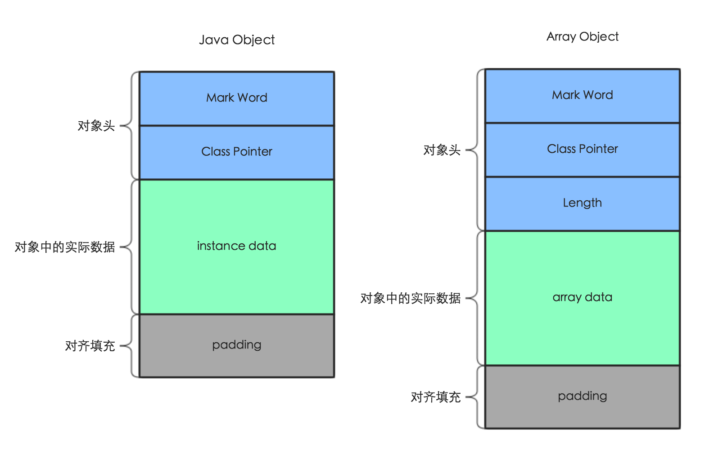

指针压缩选项有两个：UseCompressedOops（Ordinary Object Pointer） UseCompressedClassPointers，前者表示普通对象的指针压缩，后者表示类型对象的指针压缩。
只有在开启了UseCompressedOops的前提下，才能够开启UseCompressedClassPointers。也就是说`-XX:-UseCompressedOops 
-XX:+UseCompressedClassPointers`，是不会对类型指针开启压缩的。

