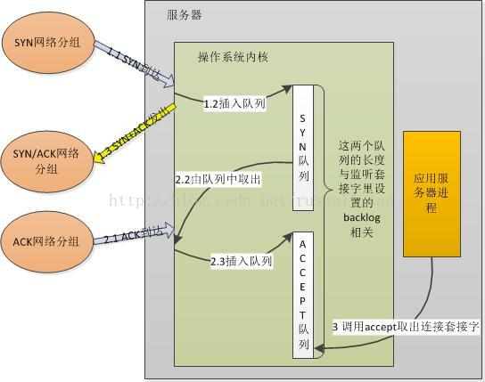

[高性能网络编程（一）----accept建立连接](https://blog.csdn.net/russell_tao/article/details/9111769)

### tcp建立连接时涉及的两个队列

### backlog的含义
[深入理解Linux TCP backlog](https://www.jianshu.com/p/7fde92785056)
意思是，backlog参数的行为在Linux2.2之后有所改变。现在，它指定了等待accept系统调用的已建立连接队列的长度，而不是待完成连接请求数。待完成连接队列长度由/proc/sys/net/ipv4/tcp_max_syn_backlog指定；在syncookies启用的情况下，逻辑上没有最大值限制，这个设置便被忽略。

Stevens建议的解决方案是简单地调大backlog。但有个问题是，应用程序在调优backlog参数时，不仅需要考虑自身对新连接的处理逻辑，还需要考虑网络状况，包括往返时间等。Linux实现实际上分成两部分：应用程序只负责调解backlog参数，确保accept调用足够快以免accept队列被塞满；系统管理员则根据网络状况调节/proc/sys/net/ipv4/tcp_max_syn_backlog，各司其职。

[SYN Cookie的原理和实现](https://blog.csdn.net/zhangskd/article/details/16986931)
为了防范SYN Flood攻击