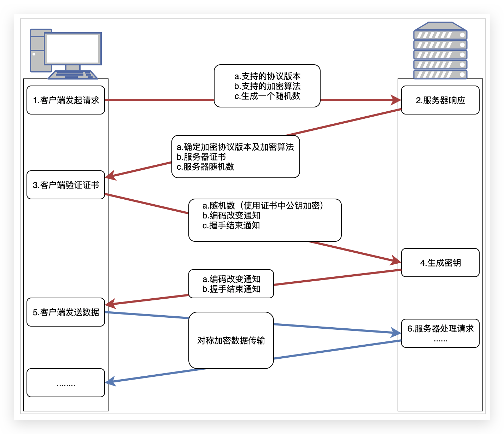

## https保证了三方面的安全性
防篡改

防窃听

识别服务器的身份，也可以识别客户端的身份（这个时候需要客户端也有自己的证书）

## 为什么需要https？
明文=裸奔
对称：key唯一 = 明文
非对称：服务端 -> 客户端 不安全
对称+非对称：中间人攻击   ==>  需要CA认证

## https流程

## 几个问题
### 1.为什么握手过程需要三个随机数？
简单来说，使用三个随机数是为了使最终的对话秘钥更加"随机"。

### 2. 只用对称加密或者非对称加密不可以么？
不可以。

对称：key唯一 = 明文

非对称：服务端 -> 客户端 不安全

### 3. charles/fiddler等可以实现对https的拦截，怎么实现的呢？
首先，charles/fiddler要实现对https的拦截，首先要做的就是，在客户端安装charles/fiddler自己导出的证书，并信任该证书。

原理就是，charles/fiddler在客户端和服务器间充当了中间人的角色，在客户端面前假装是https服务器，在真正的https服务器前假装是客户端。