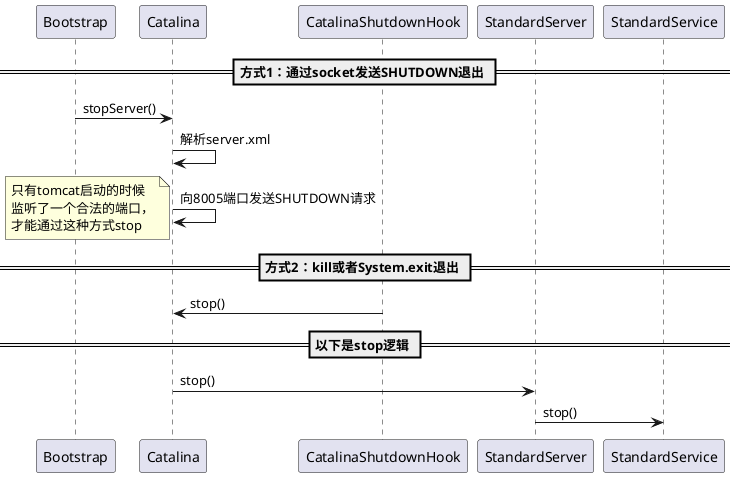

## tomcat关闭流程

```plantuml
@startuml
== 方式1：通过socket发送SHUTDOWN退出 ==
Bootstrap -> Catalina: stopServer()
Catalina -> Catalina: 解析server.xml
Catalina -> Catalina: 向8005端口发送SHUTDOWN请求

note left
    只有tomcat启动的时候
    监听了一个合法的端口，
    才能通过这种方式stop
end note

== 方式2：kill或者System.exit退出 ==
CatalinaShutdownHook -> Catalina: stop()

== 以下是stop逻辑 ==

Catalina -> StandardServer: stop()
StandardServer -> StandardService: stop()
@enduml
```

